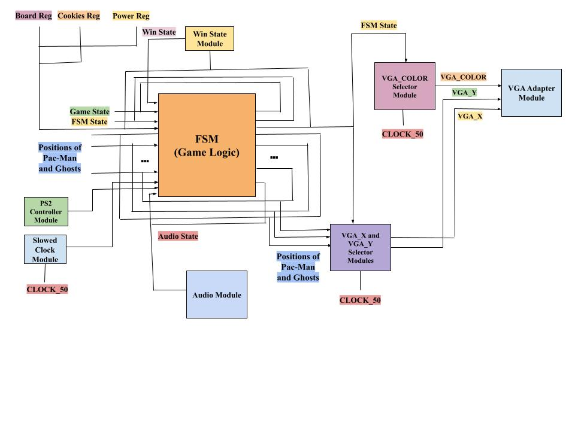
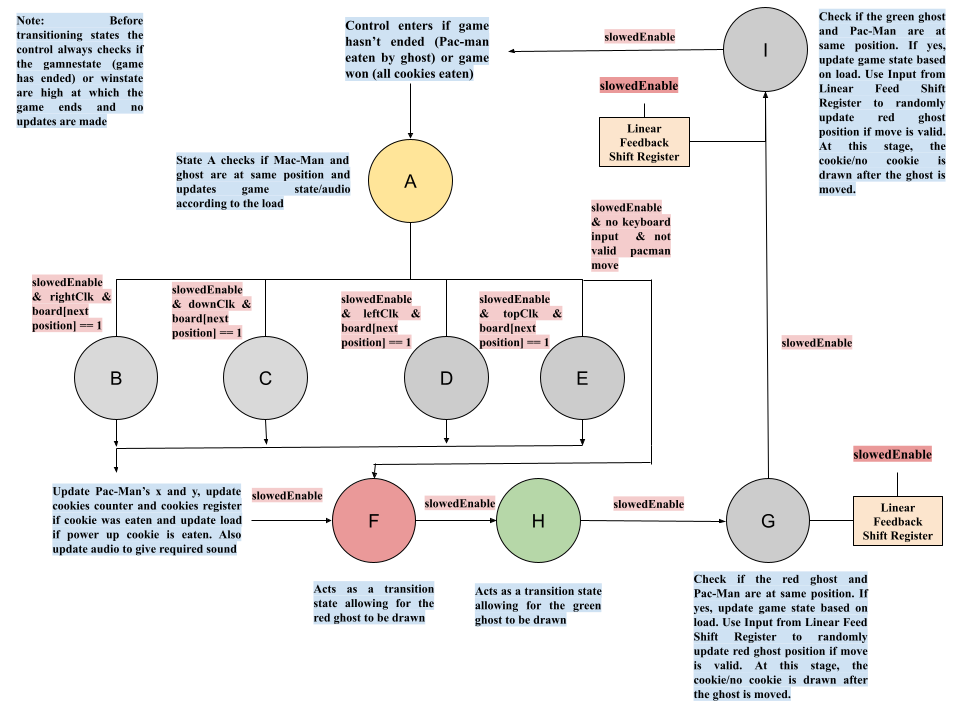

# Pacman (Verilog Edition)
This project builds a version of the classic arcade Pacman game in Verilog, tested and implemented on the DE1-SoC board.

## Demonstration

To check the full video:
[Pacman Game Demonstration](files/demonstration.mp4)

## Top Level Module Overview

## Game State Logic (FSM)

